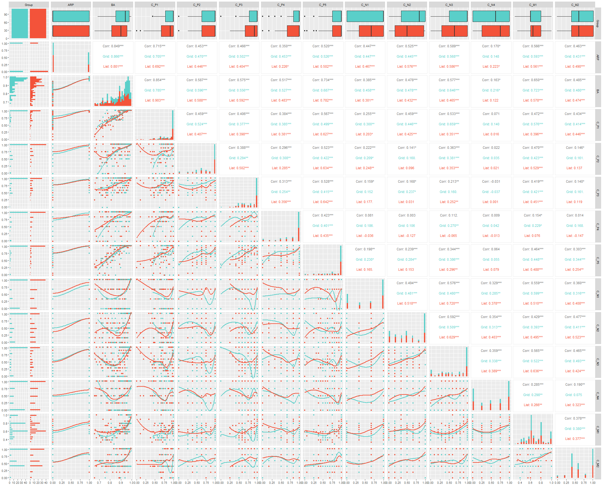

# Digital Nudges in Access Reviews: Guiding Deciders with Range and Composition

Access reviews are periodic maintenance processes to reduce excessive authorizations within organizations and to ensure compliance. Given that organizations tend to revoke only a few authorizations, we employ *Range and Composition* nudges to guide deciders in access reviews. This repository is part of an ongoing research project currently under review.

We begin by detailing the study's [Structure](#1-structure-of-the-study), including the implemented case study. Following this, we provide an overview of the [Results](#2-results-of-the-study), summarizing the findings from all participants. Additionally, we share the study's [Comments](#3-comments-of-the-study), which participants could make in a free text form. Lastly, [Scripts](#4-scripts) links the scripts to reproduce our results.

## Table of Contents
[1. Structure of the Study](#1-structure-of-the-study)  
[2. Results of the Study](#2-results-of-the-study)  
[3. Comments of the Study](#3-analysis-of-the-study) 
[4. Scripts](#4-scripts)

## 1. Structure of the Study

### Case Study

We designed an access review based on a case study, where participants were the deciders of the access review. Participants were split into two groups: 1) a list group based on a spreadsheet and 2) a grid group, offering a broader view of the authorizations. We created the following files to conduct the user study:

1. Instructions for the list group: [Instructions_List.pdf](/case/Case_List.pdf)
2. Instructions for the grid group: [Instructions_Grid.pdf](/case/Case_Grid.pdf)
3. Clusters containing all identities, permissions, authorizations, and the sample solution of the case: [Cluster.csv](/case/Case_Cluster.csv)

### Sample Solution

Figure 1 displays the grid figure solution for the use case. **Green fields** are true positives *(authorizations which should be granted and are granted)*, **red fields** are false positives *(authorizations are granted but should actually not be granted)*, and **white field** are true negatives *(these authorizations should not be granted and are not granted)*.

  

Figure 1: *Grid with the sample solution of the case*.

### Clusters
              
  

Figure 2: *Grid with marked clusters of the case*.

### User Interface for List and Grid

  

Figure 3: *List version of the Range and Composition nudge in the user study*.

 

  

Figure 4: *Grid version of the Range and Composition nudge in the user study*

### Heatmaps

Figures 5 and 6 display heatmaps based on the M for correct decisions for their respective group.

  

Figure 5: *Heatmap based on correct decisions for the list group*

 

  

Figure 6: *Heatmap based on correct decisions for the grid group*

### Pair plots

We display the pair plots of correlations in Figures 7, 8, and 9.

  

Figure 7: *Pair plot of correlations (Spearman) and local regressions for the participants of the user study*

 

  

Figure 8: *Pair plot of correlations (Spearman) and local regressions for the homogeneity between the clusters*

 

  

Figure 9: *Pair plot of correlations (Spearman) and local regressions for the correctness between the clusters*

## 2. Results of the Study

For transparency, we publish the anonymized results of the pilot study and the main user study:

1. Results of the pilot study for each participant (n=28): [participants.csv](/data/pilots/participants.csv)
2. Decisions of the pilot participants for the authorizations (n=4,480): [decisions.csv](/data/pilots/decisions.csv/)
3. Results of the main user study for each participant (n=220): [participants.csv](/data/study/participants.csv)
4. Decisions of the participants of the main user study for the authorizations (n=35,200): [decisions.csv](/data/study/decisions.csv/)

## 3. Comments of the Study

Participants could submit a comment about the access review at the end of the user study. For transparency, we provide the anonymized data set of the comments: [comments.csv](/comments/comments.csv)

## 4. Scripts

We also publish our scripts to calculate the pair plots, anova, and the figure for the local regression of accuracy BA and revokes R. We use the tool R (v4.3.2) to execute the scripts. Make sure the add Rscript to your PATH variable and look up the instructions within the scripts. Execute from the root directory of the repository:

1. ANOVA for the participant observations: `Rscript --vanilla .\scripts\anova_for_participants.r`
2. ANOVA for each cluster: `Rscript --vanilla .\scripts\anova_for_clusters.r`
3. ANOVA for each permission: `Rscript --vanilla .\scripts\anova_for_permissions.r`
4. ANOVA for each authorization: `Rscript --vanilla .\scripts\anova_for_authorizations.r`
5. Pair plot participants: `Rscript --vanilla .\scripts\pair-plot-participants.r`
6. Pair plot cluster homogeneity: `Rscript --vanilla .\scripts\pair-plot-cluster-homogeneity.r`
7. Pair plot cluster correctness: `Rscript --vanilla .\scripts\pair-plot-cluster-correctness.r`
8. Regression BA and R: `Rscript --vanilla .\scripts\Regression-R-BA.r`

